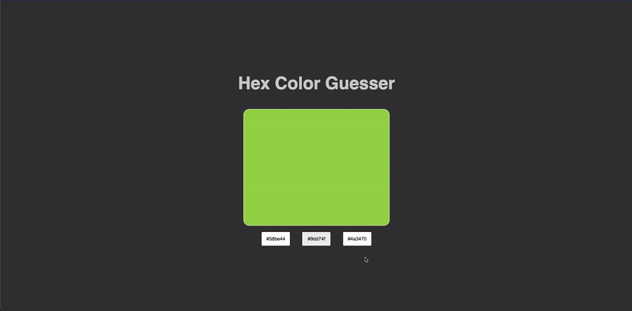

### About:

This was a timed exercise to build a hex code color guessing game. I gave myself 1 hour to complete it and this is how far I got.

This idea is from [Web Dev Junkie](https://www.youtube.com/watch?v=QNYljS0_TOE).

The only googling that I did was the RGB to Hex code helper functions.

Improvements that could be made are moving the helper functions to a new file, and making a new Component that had all three buttons and shuffled them randomly there.

### Results:

